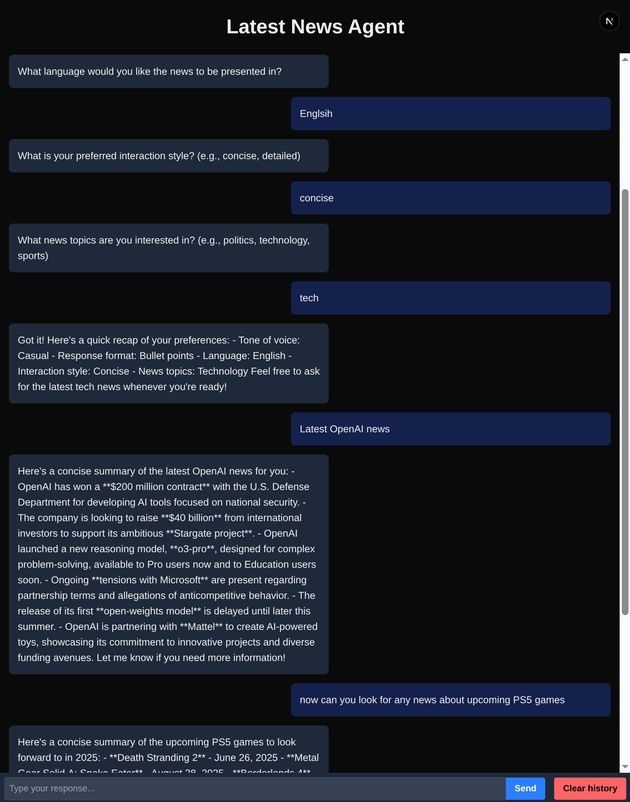

## Latest News Agent
This project serves as a demonstration of how to build an AI application with a conversational agent that can perform multi-step actions. The agent first gathers user preferences, then uses a chain of tools (`fetch_news` -> `summarize_news`) to deliver customized news summaries.


## Getting Started
This project was created with Python 3.13.3.

### Install requirements

```bash
cd backend
pip install -r requirements.txt
```

```bash
cd frontend
npm install
```

### Set up .env
Create a .env file in the backend folder:
```
EXA_API_KEY="..."
OPENAI_API_KEY="..."
```

### Run the fontend and backend servers

Run the front-end development server:

```bash
npm run dev
```

Run the back-end development server:

```bash
uvicorn main:app --reload
```
